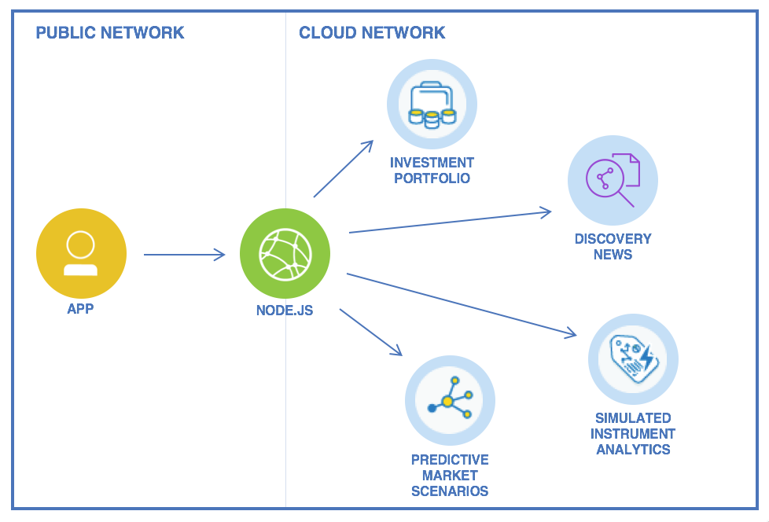
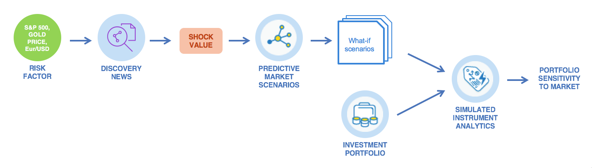

# Investment Insights for Asset Managers

[](https://travis-ci.org/IBM-Bluemix/investment-insights-for-asset-managers)


**Investment Insights for Asset Managers** is a Node.js application that uses [IBM Financial services](https://www.ibm.com/watson/financial-services/) and Watson services.  

The application is a modern portfolio manager that provides real-time insights into how news all around the world can impact any given investment portfolio.

# Overview

The project deploys a node.js Cloud Foundry application and uses the following services:
   * [Investment Portfolio](https://console.bluemix.net/catalog/services/fss-portfolio-service)
   * [Discovery](https://console.bluemix.net/catalog/services/discovery) and the pre-enriched News dataset
   * [Predictive Market Scenarios](https://console.bluemix.net/catalog/services/fss-predictive-scenario-analytics-service)
   * [Simulated Instrument Analytics](https://console.bluemix.net/catalog/services/fss-scenario-analytics-service)

   

The application uses the financial services to analyze a stock portfolio in regards to various risk factors. Risk factors include things like currency fluctuations or changes in the price of oil and gold.

   

1. User selects a risk factor to consider.
1. Using Watson Discovery, the app looks for articles related to the risk factor.
1. The app computes a shock value based on the sentiment of the articles.
1. The app calls the Predictive Market Scenarios service to create conditional scenarios to model how, given a change to a subset of factors the broader set of market factors are expected to change.
1. Finally it computes analytics on the portfolio stocks under the given scenarios.

## Deploy to Bluemix using DevOps Toolchain

The app comes with a toolchain you can use to deploy the solution with few clicks. If you want to deploy it manually, you can skip this section.

1. **Ensure your organization has enough quota for one web application using 256MB of memory and 4 services.**

1. Click ***Deploy to Bluemix*** to start the Bluemix DevOps wizard:

   [](https://console.bluemix.net/devops/setup/deploy/?repository=https://github.com/IBM-Bluemix/investment-insights-for-asset-managers&branch=master)

1. Select the **GitHub** box.

1. Decide whether you want to fork/clone the app repository.

1. If you decide to Clone, set a name for your GitHub repository.

1. Select the **Delivery Pipeline** box.

1. Select the region, organization and space where you want to deploy the app.

1. Click **Create**.

1. Select the Delivery Pipeline.

1. Wait for the Deploy job to complete.

1. Access the app when it's ready and start exploring.

## Deploy to Bluemix manually

1. If you do not already have a Bluemix account, [sign up here][bluemix_signup_url]

1. Download and install the [Cloud Foundry CLI][cloud_foundry_url] tool

1. Use this command to display or specify the URL of the API endpoint of Bluemix.

    ```
    cf api https://api.ng.bluemix.net
    ```
1. Connect to Bluemix in the command line tool and follow the prompts to log in

   ```
   cf login -a https://api.ng.bluemix.net
   ```
1. Clone the app to your local environment from your terminal using the following command:

   ```
   git clone https://github.com/IBM-Bluemix/investment-insights-for-asset-managers.git
   ```

1. `cd` into this newly created directory

1. Navigate to manifest.yml file and change the NAME "investment-insights-for-sset-managers" to an unique name of your choice. The new name is your APP_NAME in the commands below.

1. Follow the above step for SERVICES as well.


1. Create services required for this app

   ```
   cf create-service discovery lite <Discovery_Service_Name>
   ```
   _Discovery Service Name as mentioned in manifest.yml above_

   ```
   cf create-service fss-portfolio-service fss-portfolio-service-free-plan <Portfolio_Service_Name as in manifest.yml>
   ```

   ```
   cf create-service fss-predictive-scenario-analytics-service fss-predictive-scenario-analytics-service-free-plan <Predictive_Scenario_Name as in manifest.yml>
   ```
   ```
   cf create-service fss-scenario-analytics-service  fss-scenario-analytics-service-free-plan <Scenario_Analytics_Name as in manifest.yml>
   ```

1. Push the app to Bluemix

   ```
   cf push
   ```
 _This command uses the manifest.yml file in your directory to CREATE the app and BIND the services to the app_

And voila! You now have your very own application running on Bluemix.

## Run the app locally

1. If you do not already have a Bluemix account, [sign up here][bluemix_signup_url]

2. If you have not already, [download Node.js][download_node_url] and install it on your local machine.

3. In the checkout directory, create a file ```.env``` and paste the below snippet

	```
	INVESTMENT_PORFOLIO_BASE_URL=investment-portfolio.mybluemix.net
	INVESTMENT_PORFOLIO_USERNAME=
	INVESTMENT_PORFOLIO_PASSWORD=

	DISCOVERY_USERNAME=
	DISCOVERY_PASSWORD=

	PREDICTIVE_MARKET_SCENARIOS_URI=fss-analytics.mybluemix.net
	PREDICTIVE_MARKET_SCENARIOS_ACCESS_TOKEN=

	SIMULATED_INSTRUMENT_ANALYSIS_URI=fss-analytics.mybluemix.net
	SIMULATED_INSTRUMENT_ANALYSIS_ACCESS_TOKEN=
	```
1. For credentials and access tokens, run this command

    ```
    cf env APP_NAME
    ```


1. Run

   ```
   npm install
   ```

1. Run

   ```
   npm start
   ```

## Contribute

If you find a bug, please report it via the [Issues section][issues_url] or even better, fork the project and submit a pull request with your fix! We are more than happy to accept external contributions to this project if they address something noted in an existing issue.  In order to be considered, pull requests must pass the initial [Travis CI][travis_url] build and/or add substantial value to the sample application.

## Troubleshooting

The primary source of debugging information for your Bluemix app is the logs. To see them, run the following command using the Cloud Foundry CLI:

   ```
   $ cf logs APP_NAME --recent
   ```

For more detailed information on troubleshooting your application, see the [Troubleshooting section](https://www.ng.bluemix.net/docs/troubleshoot/tr.html) in the Bluemix documentation.

## License

See [License.txt](License.txt) for license information.

# Privacy Notice

This application is configured to track deployments to [IBM Bluemix](http://www.ibm.com/cloud-computing/bluemix/) and other Cloud Foundry platforms. The following information is sent to a [Deployment Tracker](https://github.com/IBM-Bluemix/cf-deployment-tracker-service) service on each deployment:

* Node.js package version
* Node.js repository URL
* Application Name (`application_name`)
* Space ID (`space_id`)
* Application Version (`application_version`)
* Application URIs (`application_uris`)
* Labels of bound services
* Number of instances for each bound service and associated plan information

This data is collected from the `package.json` file in the application and the `VCAP_APPLICATION` and `VCAP_SERVICES` environment variables in IBM Bluemix and other Cloud Foundry platforms. This data is used by IBM to track metrics around deployments of sample applications to IBM Bluemix to measure the usefulness of our examples, so that we can continuously improve the content we offer to you. Only deployments of sample applications that include code to ping the Deployment Tracker service will be tracked.

## Disabling Deployment Tracking

Deployment tracking can be disabled by removing `require("cf-deployment-tracker-client").track();` from the beginning of the `app.js` file.

[bluemix_signup_url]: https://console.bluemix.net/?cm_mmc=GitHubReadMe
[cloud_foundry_url]: https://github.com/cloudfoundry/cli
[download_node_url]: https://nodejs.org/download/
[travis_url]: https://travis-ci.org/
